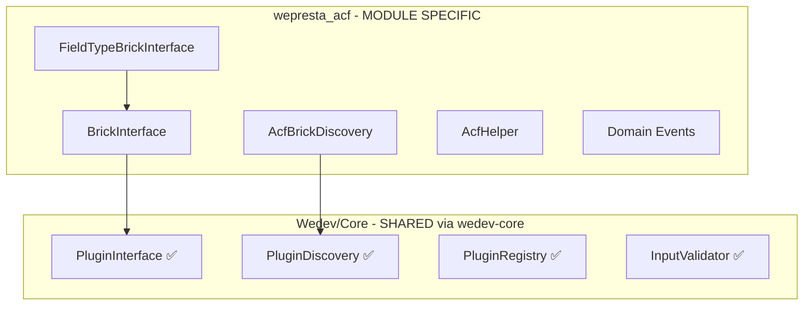

# Future-Proof Plugin System Architecture

## Status Update

### Completed in wedev-core (Shared)

The following components are now part of `wedev-core` in the CLI and synced to all modules:| Component | Location | Status ||-----------|----------|--------|| `PluginInterface` | `Wedev/Core/Contract/PluginInterface.php` | ✅ Done || `PluginDiscovery` | `Wedev/Core/Plugin/PluginDiscovery.php` | ✅ Done || `PluginRegistry` | `Wedev/Core/Plugin/PluginRegistry.php` | ✅ Done || `PluginInfo` | `Wedev/Core/Plugin/PluginInfo.php` | ✅ Done || `InputValidator` | `Wedev/Core/Security/InputValidator.php` | ✅ Done || `DependencyException` | Updated with plugin methods | ✅ Done |

### Remaining: ACF-Specific Implementation

These go in `wepresta_acf` module, NOT in wedev-core:---

## Architecture Overview



---

## Part 1: BrickInterface (ACF-Specific Plugin)

### File: `src/Application/Brick/BrickInterface.php`

Extends the shared `PluginInterface` with ACF-specific methods:

```php
<?php
declare(strict_types=1);

namespace WeprestaAcf\Application\Brick;

use WeprestaAcf\Wedev\Core\Contract\PluginInterface;

/**
    * Interface for ACF "Bricks" - mini-modules that extend ACF.
    * 
    * Bricks can provide:
    * - Custom field types
    * - Location rules
    * - Data export formats
    * - etc.
 */
interface BrickInterface extends PluginInterface
{
    /**
                    * Returns the type of brick (field_type, location, exporter, etc.)
     */
    public function getBrickType(): string;
    
    /**
                    * Returns a human-readable description.
     */
    public function getDescription(): string;
    
    /**
                    * Returns the brick author.
     */
    public function getAuthor(): string;
}
```

---

## Part 2: FieldTypeBrickInterface

### File: `src/Application/Brick/FieldTypeBrickInterface.php`

For bricks that provide custom field types:

```php
<?php
declare(strict_types=1);

namespace WeprestaAcf\Application\Brick;

use WeprestaAcf\Application\FieldType\FieldTypeInterface;

/**
    * Interface for bricks that provide custom field types.
 */
interface FieldTypeBrickInterface extends BrickInterface
{
    /**
                    * Returns the field type instance.
     */
    public function getFieldType(): FieldTypeInterface;
    
    /**
                    * Returns admin JS asset paths.
                    * @return array<string>
     */
    public function getAdminJsAssets(): array;
    
    /**
                    * Returns admin CSS asset paths.
                    * @return array<string>
     */
    public function getAdminCssAssets(): array;
}
```

---

## Part 3: AcfBrickDiscovery

### File: `src/Application/Brick/AcfBrickDiscovery.php`

Uses the shared `PluginDiscovery` with ACF-specific configuration:

```php
<?php
declare(strict_types=1);

namespace WeprestaAcf\Application\Brick;

use WeprestaAcf\Wedev\Core\Plugin\PluginDiscovery;
use WeprestaAcf\Wedev\Core\Plugin\PluginRegistry;

/**
    * Discovers ACF bricks from installed modules.
    * 
    * Wraps Core PluginDiscovery with ACF-specific paths:
    * - modules/wepresta_acf_[name]/src/Brick/
    * - themes/[name]/modules/acf_[name]/Brick/
 */
final class AcfBrickDiscovery
{
    private PluginDiscovery $coreDiscovery;
    private PluginRegistry $registry;
    
    public function __construct()
    {
        $this->coreDiscovery = new PluginDiscovery();
        $this->registry = new PluginRegistry($this->coreDiscovery);
        
        // Add ACF-specific discovery paths
        $this->coreDiscovery->addPath('modules/wepresta_acf_[name]/src/Brick');
    }
    
    /**
                    * Discovers all ACF bricks.
                    * @return array<string, BrickInterface>
     */
    public function discoverBricks(): array
    {
        $this->registry->loadAll();
        
        // Filter to only BrickInterface implementations
        return array_filter(
            $this->registry->all(),
            fn($plugin) => $plugin instanceof BrickInterface
        );
    }
    
    /**
                    * Gets field type bricks only.
                    * @return array<string, FieldTypeBrickInterface>
     */
    public function discoverFieldTypeBricks(): array
    {
        return array_filter(
            $this->discoverBricks(),
            fn($brick) => $brick instanceof FieldTypeBrickInterface
        );
    }
    
    /**
                    * Collects all field types from all bricks.
                    * @return array<string, class-string>
     */
    public function collectFieldTypes(): array
    {
        $fieldTypes = [];
        
        foreach ($this->discoverFieldTypeBricks() as $brick) {
            $type = $brick->getFieldType();
            $fieldTypes[$type->getType()] = get_class($type);
        }
        
        return $fieldTypes;
    }
}
```

---

## Part 4: AcfHelper (Template API)

### File: `src/Application/Helper/AcfHelper.php`

Public API for accessing ACF field values in templates:

```php
<?php
declare(strict_types=1);

namespace WeprestaAcf\Application\Helper;

use WeprestaAcf\Infrastructure\Repository\AcfFieldValueRepository;
use WeprestaAcf\Infrastructure\Repository\AcfFieldRepository;

/**
    * Helper class for accessing ACF field values in templates.
    * 
    * @example
    * // In Smarty template
    * {$acf_color = AcfHelper::getField('product_color', $product->id, 'product')}
    * 
    * // In PHP
    * $color = AcfHelper::getField('product_color', $productId, 'product');
 */
final class AcfHelper
{
    private static ?AcfFieldValueRepository $valueRepository = null;
    private static ?AcfFieldRepository $fieldRepository = null;
    
    /**
                    * Gets a single field value.
     */
    public static function getField(
        string $slug, 
        int $objectId, 
        string $objectType = 'product',
        ?int $langId = null
    ): mixed {
        $langId ??= (int) \Context::getContext()->language->id;
        
        return self::getValueRepository()->getValue(
            $slug,
            $objectId,
            $objectType,
            $langId
        );
    }
    
    /**
                    * Gets all field values for an object.
                    * @return array<string, mixed>
     */
    public static function getFields(
        int $objectId, 
        string $objectType = 'product',
        ?int $langId = null
    ): array {
        $langId ??= (int) \Context::getContext()->language->id;
        
        return self::getValueRepository()->getValuesForObject(
            $objectId,
            $objectType,
            $langId
        );
    }
    
    /**
                    * Checks if an object has a specific field.
     */
    public static function hasField(
        string $slug, 
        int $objectId, 
        string $objectType = 'product'
    ): bool {
        return self::getField($slug, $objectId, $objectType) !== null;
    }
    
    /**
                    * Renders a field value as HTML.
     */
    public static function renderField(
        string $slug, 
        int $objectId, 
        string $objectType = 'product',
        ?int $langId = null
    ): string {
        $value = self::getField($slug, $objectId, $objectType, $langId);
        
        if ($value === null) {
            return '';
        }
        
        // Get field config for rendering
        $field = self::getFieldRepository()->findBySlug($slug);
        
        if ($field === null) {
            return (string) $value;
        }
        
        // TODO: Use FieldTypeLoader to get proper renderer
        return (string) $value;
    }
    
    private static function getValueRepository(): AcfFieldValueRepository
    {
        if (self::$valueRepository === null) {
            self::$valueRepository = new AcfFieldValueRepository();
        }
        return self::$valueRepository;
    }
    
    private static function getFieldRepository(): AcfFieldRepository
    {
        if (self::$fieldRepository === null) {
            self::$fieldRepository = new AcfFieldRepository();
        }
        return self::$fieldRepository;
    }
}
```

---

## Part 5: Domain Events

### Files in `src/Domain/Event/`

#### GroupCreated.php

```php
<?php
declare(strict_types=1);

namespace WeprestaAcf\Domain\Event;

final readonly class GroupCreated
{
    public function __construct(
        public int $groupId,
        public string $title,
        public string $slug
    ) {}
}
```

#### GroupUpdated.php

```php
<?php
declare(strict_types=1);

namespace WeprestaAcf\Domain\Event;

final readonly class GroupUpdated
{
    public function __construct(
        public int $groupId,
        public array $changes
    ) {}
}
```

#### GroupDeleted.php

```php
<?php
declare(strict_types=1);

namespace WeprestaAcf\Domain\Event;

final readonly class GroupDeleted
{
    public function __construct(
        public int $groupId,
        public string $slug
    ) {}
}
```

#### FieldValueSaved.php

```php
<?php
declare(strict_types=1);

namespace WeprestaAcf\Domain\Event;

final readonly class FieldValueSaved
{
    public function __construct(
        public int $fieldId,
        public string $fieldSlug,
        public int $objectId,
        public string $objectType,
        public mixed $oldValue,
        public mixed $newValue
    ) {}
}
```

---

## Integration with FieldTypeLoader

### Update `src/Application/Service/FieldTypeLoader.php`

Add brick discovery integration:

```php
// In loadFieldTypes() method, after loading core types:

// Discover field types from bricks
$brickDiscovery = new AcfBrickDiscovery();
$brickFieldTypes = $brickDiscovery->collectFieldTypes();

foreach ($brickFieldTypes as $type => $className) {
    if (!isset($this->fieldTypes[$type])) {
        $this->fieldTypes[$type] = $className;
    }
}
```

---

## services.yml Registration

```yaml
# Brick Discovery
wepresta_acf.brick_discovery:
    class: WeprestaAcf\Application\Brick\AcfBrickDiscovery
    public: true

# AcfHelper doesn't need registration (static methods)
```

---

## Third-Party Brick Example

### Module: `wepresta_acf_signature`

```javascript
wepresta_acf_signature/
├── wepresta_acf_signature.php
├── src/
│   └── Brick/
│       └── SignatureBrick.php
└── views/
    └── js/
        └── signature-field.js
```

### SignatureBrick.php

```php
<?php
declare(strict_types=1);

namespace WeprestaAcfSignature\Brick;

use WeprestaAcf\Application\Brick\FieldTypeBrickInterface;
use WeprestaAcf\Application\FieldType\FieldTypeInterface;

final class SignatureBrick implements FieldTypeBrickInterface
{
    public static function getName(): string { return 'wepresta_acf_signature'; }
    public static function getVersion(): string { return '1.0.0'; }
    public static function getDependencies(): array { return ['wepresta_acf']; }
    
    public function boot(): void {}
    public function getFieldTypes(): array { return ['signature' => SignatureField::class]; }
    public function getServices(): array { return []; }
    
    public function getBrickType(): string { return 'field_type'; }
    public function getDescription(): string { return 'Signature pad field type'; }
    public function getAuthor(): string { return 'WECODE'; }
    
    public function getFieldType(): FieldTypeInterface
    {
        return new SignatureField();
    }
    
    public function getAdminJsAssets(): array
    {
        return ['/modules/wepresta_acf_signature/views/js/signature-field.js'];
    }
    
    public function getAdminCssAssets(): array
    {
        return [];
    }
}
```

---